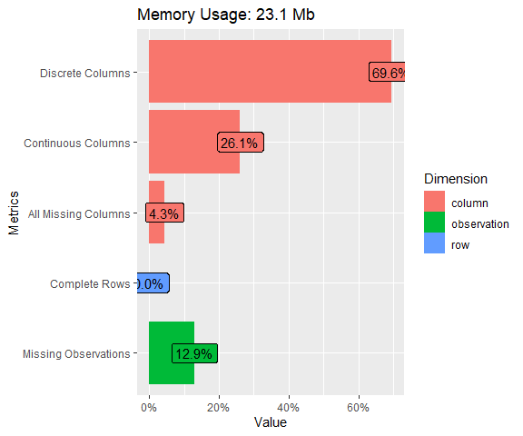
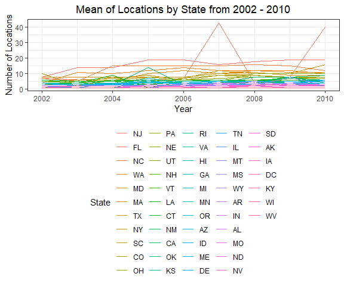
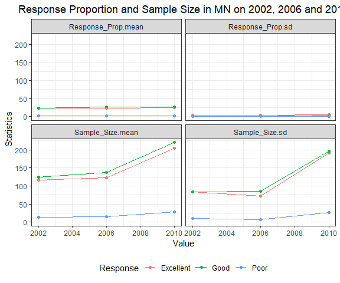

PubH7462_hw2_panxx408
================
Mingming Pan
2/9/2022

``` r
#Read data
brfss_df <- read_csv("./data/brfss_smart_2010.csv")
```

## Problem3.1 Data Exploration & Cleaning

``` r
#Data Exploration
plot_str(brfss_df)
plot_intro(brfss_df)
```



``` r
#Date Cleaning
brfss_clean <- brfss_df %>% separate(col = Locationdesc, into = c("State", "2", "County"),
                                     sep = " ") %>%
  filter(Topic == "Overall Health") %>%
  select(Year, State, County, Response, Sample_Size, Data_value) %>%
  rename(Response_Prop = Data_value) %>%
  mutate(State = as.factor(State)) %>%
  mutate(County = as.factor(County))
```

## 3.2 Data Description

-   There are 6 variables and 10625 observations.
-   Each observation represents details of one of the response of a
    county at a specific year.
-   Year, State, County, Response, Response Proportion and sample size
    are the six variables.
-   Year describes the year taking the questionnaire; State and County
    describe the locations; Response describes the type of responses and
    response proportion indicates the proportion of corresponding
    response; and sample size describes the sample size of corresponding
    response.
-   The number of countys taking the questionnaire varies from year to
    year.

## 3.3 Do Data Science

### 3.3.1In the year 2004, which states were observed at 6 locations?

``` r
brfss_clean %>%
  filter(Year == "2004") %>%
  select(State, County) %>%
  distinct() %>%
  group_by(State) %>%
  summarise(Locations = n()) %>%
  filter(Locations == 6) %>%
  gt() %>%
  cols_label(Locations = "Number of Locations") %>%
  tab_header("States were Observed at 6 Locations in 2004")
```

<div id="qmqtgdablq" style="overflow-x:auto;overflow-y:auto;width:auto;height:auto;">
<style>html {
  font-family: -apple-system, BlinkMacSystemFont, 'Segoe UI', Roboto, Oxygen, Ubuntu, Cantarell, 'Helvetica Neue', 'Fira Sans', 'Droid Sans', Arial, sans-serif;
}

#qmqtgdablq .gt_table {
  display: table;
  border-collapse: collapse;
  margin-left: auto;
  margin-right: auto;
  color: #333333;
  font-size: 16px;
  font-weight: normal;
  font-style: normal;
  background-color: #FFFFFF;
  width: auto;
  border-top-style: solid;
  border-top-width: 2px;
  border-top-color: #A8A8A8;
  border-right-style: none;
  border-right-width: 2px;
  border-right-color: #D3D3D3;
  border-bottom-style: solid;
  border-bottom-width: 2px;
  border-bottom-color: #A8A8A8;
  border-left-style: none;
  border-left-width: 2px;
  border-left-color: #D3D3D3;
}

#qmqtgdablq .gt_heading {
  background-color: #FFFFFF;
  text-align: center;
  border-bottom-color: #FFFFFF;
  border-left-style: none;
  border-left-width: 1px;
  border-left-color: #D3D3D3;
  border-right-style: none;
  border-right-width: 1px;
  border-right-color: #D3D3D3;
}

#qmqtgdablq .gt_title {
  color: #333333;
  font-size: 125%;
  font-weight: initial;
  padding-top: 4px;
  padding-bottom: 4px;
  border-bottom-color: #FFFFFF;
  border-bottom-width: 0;
}

#qmqtgdablq .gt_subtitle {
  color: #333333;
  font-size: 85%;
  font-weight: initial;
  padding-top: 0;
  padding-bottom: 6px;
  border-top-color: #FFFFFF;
  border-top-width: 0;
}

#qmqtgdablq .gt_bottom_border {
  border-bottom-style: solid;
  border-bottom-width: 2px;
  border-bottom-color: #D3D3D3;
}

#qmqtgdablq .gt_col_headings {
  border-top-style: solid;
  border-top-width: 2px;
  border-top-color: #D3D3D3;
  border-bottom-style: solid;
  border-bottom-width: 2px;
  border-bottom-color: #D3D3D3;
  border-left-style: none;
  border-left-width: 1px;
  border-left-color: #D3D3D3;
  border-right-style: none;
  border-right-width: 1px;
  border-right-color: #D3D3D3;
}

#qmqtgdablq .gt_col_heading {
  color: #333333;
  background-color: #FFFFFF;
  font-size: 100%;
  font-weight: normal;
  text-transform: inherit;
  border-left-style: none;
  border-left-width: 1px;
  border-left-color: #D3D3D3;
  border-right-style: none;
  border-right-width: 1px;
  border-right-color: #D3D3D3;
  vertical-align: bottom;
  padding-top: 5px;
  padding-bottom: 6px;
  padding-left: 5px;
  padding-right: 5px;
  overflow-x: hidden;
}

#qmqtgdablq .gt_column_spanner_outer {
  color: #333333;
  background-color: #FFFFFF;
  font-size: 100%;
  font-weight: normal;
  text-transform: inherit;
  padding-top: 0;
  padding-bottom: 0;
  padding-left: 4px;
  padding-right: 4px;
}

#qmqtgdablq .gt_column_spanner_outer:first-child {
  padding-left: 0;
}

#qmqtgdablq .gt_column_spanner_outer:last-child {
  padding-right: 0;
}

#qmqtgdablq .gt_column_spanner {
  border-bottom-style: solid;
  border-bottom-width: 2px;
  border-bottom-color: #D3D3D3;
  vertical-align: bottom;
  padding-top: 5px;
  padding-bottom: 5px;
  overflow-x: hidden;
  display: inline-block;
  width: 100%;
}

#qmqtgdablq .gt_group_heading {
  padding: 8px;
  color: #333333;
  background-color: #FFFFFF;
  font-size: 100%;
  font-weight: initial;
  text-transform: inherit;
  border-top-style: solid;
  border-top-width: 2px;
  border-top-color: #D3D3D3;
  border-bottom-style: solid;
  border-bottom-width: 2px;
  border-bottom-color: #D3D3D3;
  border-left-style: none;
  border-left-width: 1px;
  border-left-color: #D3D3D3;
  border-right-style: none;
  border-right-width: 1px;
  border-right-color: #D3D3D3;
  vertical-align: middle;
}

#qmqtgdablq .gt_empty_group_heading {
  padding: 0.5px;
  color: #333333;
  background-color: #FFFFFF;
  font-size: 100%;
  font-weight: initial;
  border-top-style: solid;
  border-top-width: 2px;
  border-top-color: #D3D3D3;
  border-bottom-style: solid;
  border-bottom-width: 2px;
  border-bottom-color: #D3D3D3;
  vertical-align: middle;
}

#qmqtgdablq .gt_from_md > :first-child {
  margin-top: 0;
}

#qmqtgdablq .gt_from_md > :last-child {
  margin-bottom: 0;
}

#qmqtgdablq .gt_row {
  padding-top: 8px;
  padding-bottom: 8px;
  padding-left: 5px;
  padding-right: 5px;
  margin: 10px;
  border-top-style: solid;
  border-top-width: 1px;
  border-top-color: #D3D3D3;
  border-left-style: none;
  border-left-width: 1px;
  border-left-color: #D3D3D3;
  border-right-style: none;
  border-right-width: 1px;
  border-right-color: #D3D3D3;
  vertical-align: middle;
  overflow-x: hidden;
}

#qmqtgdablq .gt_stub {
  color: #333333;
  background-color: #FFFFFF;
  font-size: 100%;
  font-weight: initial;
  text-transform: inherit;
  border-right-style: solid;
  border-right-width: 2px;
  border-right-color: #D3D3D3;
  padding-left: 12px;
}

#qmqtgdablq .gt_summary_row {
  color: #333333;
  background-color: #FFFFFF;
  text-transform: inherit;
  padding-top: 8px;
  padding-bottom: 8px;
  padding-left: 5px;
  padding-right: 5px;
}

#qmqtgdablq .gt_first_summary_row {
  padding-top: 8px;
  padding-bottom: 8px;
  padding-left: 5px;
  padding-right: 5px;
  border-top-style: solid;
  border-top-width: 2px;
  border-top-color: #D3D3D3;
}

#qmqtgdablq .gt_grand_summary_row {
  color: #333333;
  background-color: #FFFFFF;
  text-transform: inherit;
  padding-top: 8px;
  padding-bottom: 8px;
  padding-left: 5px;
  padding-right: 5px;
}

#qmqtgdablq .gt_first_grand_summary_row {
  padding-top: 8px;
  padding-bottom: 8px;
  padding-left: 5px;
  padding-right: 5px;
  border-top-style: double;
  border-top-width: 6px;
  border-top-color: #D3D3D3;
}

#qmqtgdablq .gt_striped {
  background-color: rgba(128, 128, 128, 0.05);
}

#qmqtgdablq .gt_table_body {
  border-top-style: solid;
  border-top-width: 2px;
  border-top-color: #D3D3D3;
  border-bottom-style: solid;
  border-bottom-width: 2px;
  border-bottom-color: #D3D3D3;
}

#qmqtgdablq .gt_footnotes {
  color: #333333;
  background-color: #FFFFFF;
  border-bottom-style: none;
  border-bottom-width: 2px;
  border-bottom-color: #D3D3D3;
  border-left-style: none;
  border-left-width: 2px;
  border-left-color: #D3D3D3;
  border-right-style: none;
  border-right-width: 2px;
  border-right-color: #D3D3D3;
}

#qmqtgdablq .gt_footnote {
  margin: 0px;
  font-size: 90%;
  padding: 4px;
}

#qmqtgdablq .gt_sourcenotes {
  color: #333333;
  background-color: #FFFFFF;
  border-bottom-style: none;
  border-bottom-width: 2px;
  border-bottom-color: #D3D3D3;
  border-left-style: none;
  border-left-width: 2px;
  border-left-color: #D3D3D3;
  border-right-style: none;
  border-right-width: 2px;
  border-right-color: #D3D3D3;
}

#qmqtgdablq .gt_sourcenote {
  font-size: 90%;
  padding: 4px;
}

#qmqtgdablq .gt_left {
  text-align: left;
}

#qmqtgdablq .gt_center {
  text-align: center;
}

#qmqtgdablq .gt_right {
  text-align: right;
  font-variant-numeric: tabular-nums;
}

#qmqtgdablq .gt_font_normal {
  font-weight: normal;
}

#qmqtgdablq .gt_font_bold {
  font-weight: bold;
}

#qmqtgdablq .gt_font_italic {
  font-style: italic;
}

#qmqtgdablq .gt_super {
  font-size: 65%;
}

#qmqtgdablq .gt_footnote_marks {
  font-style: italic;
  font-weight: normal;
  font-size: 65%;
}
</style>
<table class="gt_table">
  <thead class="gt_header">
    <tr>
      <th colspan="2" class="gt_heading gt_title gt_font_normal gt_bottom_border" style>States were Observed at 6 Locations in 2004</th>
    </tr>
    
  </thead>
  <thead class="gt_col_headings">
    <tr>
      <th class="gt_col_heading gt_columns_bottom_border gt_center" rowspan="1" colspan="1">State</th>
      <th class="gt_col_heading gt_columns_bottom_border gt_right" rowspan="1" colspan="1">Number of Locations</th>
    </tr>
  </thead>
  <tbody class="gt_table_body">
    <tr><td class="gt_row gt_center">CO</td>
<td class="gt_row gt_right">6</td></tr>
    <tr><td class="gt_row gt_center">NM</td>
<td class="gt_row gt_right">6</td></tr>
    <tr><td class="gt_row gt_center">SC</td>
<td class="gt_row gt_right">6</td></tr>
    <tr><td class="gt_row gt_center">TX</td>
<td class="gt_row gt_right">6</td></tr>
    <tr><td class="gt_row gt_center">UT</td>
<td class="gt_row gt_right">6</td></tr>
    <tr><td class="gt_row gt_center">VT</td>
<td class="gt_row gt_right">6</td></tr>
  </tbody>
  
  
</table>
</div>

**CO, NM, SC, TX, UT and VT were observed at 6 locations in 2004.**

### 3.3.2 Make a spaghetti plot that shows the number of observed locations in each state from 2002 to 2010. Which state has the highest mean number of locations over this period?

``` r
brfss_clean %>% filter(Year > 2001 & Year < 2011) %>%
  select(Year, State, County) %>%
  distinct() %>% 
  group_by(State, Year) %>%
  summarise(Location = n()) %>% 
  ungroup(Year, State) %>%
  mutate(State = fct_reorder(State, Location, mean, .desc = TRUE)) %>%
  ggplot() +
  geom_line(aes(x = Year, y = Location, group = State, color = State)) +
  labs(
    x = "Year",
    y = "Number of Locations",
    title = "Mean of Locations by State from 2002 - 2010"
  )
```



**NJ is the state which has the highest mean number of locations over
the period.**

### 3.3.3 Make a table showing, for the years 2002, 2006, and 2010, the mean and standard deviation of sample size and proportion of Excellent, Good, and Poor responses across locations in MN.

``` r
brfss_clean %>% filter(Year %in% c("2002", "2006", "2010"),
                       State == "MN",
                       Response %in% c("Excellent", "Good", "Poor")) %>%
  group_by(Response, Year) %>%
  summarise(across(c(Sample_Size, Response_Prop), 
                   list(mean = mean,
                        sd = sd),
                   na.rm = FALSE,
                   .names = "{.col}.{.fn}")) %>%
    gt() %>%
  tab_header("Response Proportion and Sample Size in MN on 2002, 2006 and 2010") 
```

<div id="sgjsokejlu" style="overflow-x:auto;overflow-y:auto;width:auto;height:auto;">
<style>html {
  font-family: -apple-system, BlinkMacSystemFont, 'Segoe UI', Roboto, Oxygen, Ubuntu, Cantarell, 'Helvetica Neue', 'Fira Sans', 'Droid Sans', Arial, sans-serif;
}

#sgjsokejlu .gt_table {
  display: table;
  border-collapse: collapse;
  margin-left: auto;
  margin-right: auto;
  color: #333333;
  font-size: 16px;
  font-weight: normal;
  font-style: normal;
  background-color: #FFFFFF;
  width: auto;
  border-top-style: solid;
  border-top-width: 2px;
  border-top-color: #A8A8A8;
  border-right-style: none;
  border-right-width: 2px;
  border-right-color: #D3D3D3;
  border-bottom-style: solid;
  border-bottom-width: 2px;
  border-bottom-color: #A8A8A8;
  border-left-style: none;
  border-left-width: 2px;
  border-left-color: #D3D3D3;
}

#sgjsokejlu .gt_heading {
  background-color: #FFFFFF;
  text-align: center;
  border-bottom-color: #FFFFFF;
  border-left-style: none;
  border-left-width: 1px;
  border-left-color: #D3D3D3;
  border-right-style: none;
  border-right-width: 1px;
  border-right-color: #D3D3D3;
}

#sgjsokejlu .gt_title {
  color: #333333;
  font-size: 125%;
  font-weight: initial;
  padding-top: 4px;
  padding-bottom: 4px;
  border-bottom-color: #FFFFFF;
  border-bottom-width: 0;
}

#sgjsokejlu .gt_subtitle {
  color: #333333;
  font-size: 85%;
  font-weight: initial;
  padding-top: 0;
  padding-bottom: 6px;
  border-top-color: #FFFFFF;
  border-top-width: 0;
}

#sgjsokejlu .gt_bottom_border {
  border-bottom-style: solid;
  border-bottom-width: 2px;
  border-bottom-color: #D3D3D3;
}

#sgjsokejlu .gt_col_headings {
  border-top-style: solid;
  border-top-width: 2px;
  border-top-color: #D3D3D3;
  border-bottom-style: solid;
  border-bottom-width: 2px;
  border-bottom-color: #D3D3D3;
  border-left-style: none;
  border-left-width: 1px;
  border-left-color: #D3D3D3;
  border-right-style: none;
  border-right-width: 1px;
  border-right-color: #D3D3D3;
}

#sgjsokejlu .gt_col_heading {
  color: #333333;
  background-color: #FFFFFF;
  font-size: 100%;
  font-weight: normal;
  text-transform: inherit;
  border-left-style: none;
  border-left-width: 1px;
  border-left-color: #D3D3D3;
  border-right-style: none;
  border-right-width: 1px;
  border-right-color: #D3D3D3;
  vertical-align: bottom;
  padding-top: 5px;
  padding-bottom: 6px;
  padding-left: 5px;
  padding-right: 5px;
  overflow-x: hidden;
}

#sgjsokejlu .gt_column_spanner_outer {
  color: #333333;
  background-color: #FFFFFF;
  font-size: 100%;
  font-weight: normal;
  text-transform: inherit;
  padding-top: 0;
  padding-bottom: 0;
  padding-left: 4px;
  padding-right: 4px;
}

#sgjsokejlu .gt_column_spanner_outer:first-child {
  padding-left: 0;
}

#sgjsokejlu .gt_column_spanner_outer:last-child {
  padding-right: 0;
}

#sgjsokejlu .gt_column_spanner {
  border-bottom-style: solid;
  border-bottom-width: 2px;
  border-bottom-color: #D3D3D3;
  vertical-align: bottom;
  padding-top: 5px;
  padding-bottom: 5px;
  overflow-x: hidden;
  display: inline-block;
  width: 100%;
}

#sgjsokejlu .gt_group_heading {
  padding: 8px;
  color: #333333;
  background-color: #FFFFFF;
  font-size: 100%;
  font-weight: initial;
  text-transform: inherit;
  border-top-style: solid;
  border-top-width: 2px;
  border-top-color: #D3D3D3;
  border-bottom-style: solid;
  border-bottom-width: 2px;
  border-bottom-color: #D3D3D3;
  border-left-style: none;
  border-left-width: 1px;
  border-left-color: #D3D3D3;
  border-right-style: none;
  border-right-width: 1px;
  border-right-color: #D3D3D3;
  vertical-align: middle;
}

#sgjsokejlu .gt_empty_group_heading {
  padding: 0.5px;
  color: #333333;
  background-color: #FFFFFF;
  font-size: 100%;
  font-weight: initial;
  border-top-style: solid;
  border-top-width: 2px;
  border-top-color: #D3D3D3;
  border-bottom-style: solid;
  border-bottom-width: 2px;
  border-bottom-color: #D3D3D3;
  vertical-align: middle;
}

#sgjsokejlu .gt_from_md > :first-child {
  margin-top: 0;
}

#sgjsokejlu .gt_from_md > :last-child {
  margin-bottom: 0;
}

#sgjsokejlu .gt_row {
  padding-top: 8px;
  padding-bottom: 8px;
  padding-left: 5px;
  padding-right: 5px;
  margin: 10px;
  border-top-style: solid;
  border-top-width: 1px;
  border-top-color: #D3D3D3;
  border-left-style: none;
  border-left-width: 1px;
  border-left-color: #D3D3D3;
  border-right-style: none;
  border-right-width: 1px;
  border-right-color: #D3D3D3;
  vertical-align: middle;
  overflow-x: hidden;
}

#sgjsokejlu .gt_stub {
  color: #333333;
  background-color: #FFFFFF;
  font-size: 100%;
  font-weight: initial;
  text-transform: inherit;
  border-right-style: solid;
  border-right-width: 2px;
  border-right-color: #D3D3D3;
  padding-left: 12px;
}

#sgjsokejlu .gt_summary_row {
  color: #333333;
  background-color: #FFFFFF;
  text-transform: inherit;
  padding-top: 8px;
  padding-bottom: 8px;
  padding-left: 5px;
  padding-right: 5px;
}

#sgjsokejlu .gt_first_summary_row {
  padding-top: 8px;
  padding-bottom: 8px;
  padding-left: 5px;
  padding-right: 5px;
  border-top-style: solid;
  border-top-width: 2px;
  border-top-color: #D3D3D3;
}

#sgjsokejlu .gt_grand_summary_row {
  color: #333333;
  background-color: #FFFFFF;
  text-transform: inherit;
  padding-top: 8px;
  padding-bottom: 8px;
  padding-left: 5px;
  padding-right: 5px;
}

#sgjsokejlu .gt_first_grand_summary_row {
  padding-top: 8px;
  padding-bottom: 8px;
  padding-left: 5px;
  padding-right: 5px;
  border-top-style: double;
  border-top-width: 6px;
  border-top-color: #D3D3D3;
}

#sgjsokejlu .gt_striped {
  background-color: rgba(128, 128, 128, 0.05);
}

#sgjsokejlu .gt_table_body {
  border-top-style: solid;
  border-top-width: 2px;
  border-top-color: #D3D3D3;
  border-bottom-style: solid;
  border-bottom-width: 2px;
  border-bottom-color: #D3D3D3;
}

#sgjsokejlu .gt_footnotes {
  color: #333333;
  background-color: #FFFFFF;
  border-bottom-style: none;
  border-bottom-width: 2px;
  border-bottom-color: #D3D3D3;
  border-left-style: none;
  border-left-width: 2px;
  border-left-color: #D3D3D3;
  border-right-style: none;
  border-right-width: 2px;
  border-right-color: #D3D3D3;
}

#sgjsokejlu .gt_footnote {
  margin: 0px;
  font-size: 90%;
  padding: 4px;
}

#sgjsokejlu .gt_sourcenotes {
  color: #333333;
  background-color: #FFFFFF;
  border-bottom-style: none;
  border-bottom-width: 2px;
  border-bottom-color: #D3D3D3;
  border-left-style: none;
  border-left-width: 2px;
  border-left-color: #D3D3D3;
  border-right-style: none;
  border-right-width: 2px;
  border-right-color: #D3D3D3;
}

#sgjsokejlu .gt_sourcenote {
  font-size: 90%;
  padding: 4px;
}

#sgjsokejlu .gt_left {
  text-align: left;
}

#sgjsokejlu .gt_center {
  text-align: center;
}

#sgjsokejlu .gt_right {
  text-align: right;
  font-variant-numeric: tabular-nums;
}

#sgjsokejlu .gt_font_normal {
  font-weight: normal;
}

#sgjsokejlu .gt_font_bold {
  font-weight: bold;
}

#sgjsokejlu .gt_font_italic {
  font-style: italic;
}

#sgjsokejlu .gt_super {
  font-size: 65%;
}

#sgjsokejlu .gt_footnote_marks {
  font-style: italic;
  font-weight: normal;
  font-size: 65%;
}
</style>
<table class="gt_table">
  <thead class="gt_header">
    <tr>
      <th colspan="5" class="gt_heading gt_title gt_font_normal gt_bottom_border" style>Response Proportion and Sample Size in MN on 2002, 2006 and 2010</th>
    </tr>
    
  </thead>
  <thead class="gt_col_headings">
    <tr>
      <th class="gt_col_heading gt_columns_bottom_border gt_right" rowspan="1" colspan="1">Year</th>
      <th class="gt_col_heading gt_columns_bottom_border gt_right" rowspan="1" colspan="1">Sample_Size.mean</th>
      <th class="gt_col_heading gt_columns_bottom_border gt_right" rowspan="1" colspan="1">Sample_Size.sd</th>
      <th class="gt_col_heading gt_columns_bottom_border gt_right" rowspan="1" colspan="1">Response_Prop.mean</th>
      <th class="gt_col_heading gt_columns_bottom_border gt_right" rowspan="1" colspan="1">Response_Prop.sd</th>
    </tr>
  </thead>
  <tbody class="gt_table_body">
    <tr class="gt_group_heading_row">
      <td colspan="5" class="gt_group_heading">Excellent</td>
    </tr>
    <tr><td class="gt_row gt_right">2002</td>
<td class="gt_row gt_right">116.00</td>
<td class="gt_row gt_right">83.275</td>
<td class="gt_row gt_right">24.15</td>
<td class="gt_row gt_right">3.5407</td></tr>
    <tr><td class="gt_row gt_right">2006</td>
<td class="gt_row gt_right">122.33</td>
<td class="gt_row gt_right">72.625</td>
<td class="gt_row gt_right">23.83</td>
<td class="gt_row gt_right">2.9872</td></tr>
    <tr><td class="gt_row gt_right">2010</td>
<td class="gt_row gt_right">203.80</td>
<td class="gt_row gt_right">190.598</td>
<td class="gt_row gt_right">25.44</td>
<td class="gt_row gt_right">5.2776</td></tr>
    <tr class="gt_group_heading_row">
      <td colspan="5" class="gt_group_heading">Good</td>
    </tr>
    <tr><td class="gt_row gt_right">2002</td>
<td class="gt_row gt_right">123.75</td>
<td class="gt_row gt_right">84.263</td>
<td class="gt_row gt_right">23.95</td>
<td class="gt_row gt_right">1.0472</td></tr>
    <tr><td class="gt_row gt_right">2006</td>
<td class="gt_row gt_right">137.33</td>
<td class="gt_row gt_right">85.816</td>
<td class="gt_row gt_right">26.37</td>
<td class="gt_row gt_right">0.4509</td></tr>
    <tr><td class="gt_row gt_right">2010</td>
<td class="gt_row gt_right">220.00</td>
<td class="gt_row gt_right">196.099</td>
<td class="gt_row gt_right">26.04</td>
<td class="gt_row gt_right">3.5473</td></tr>
    <tr class="gt_group_heading_row">
      <td colspan="5" class="gt_group_heading">Poor</td>
    </tr>
    <tr><td class="gt_row gt_right">2002</td>
<td class="gt_row gt_right">13.75</td>
<td class="gt_row gt_right">9.570</td>
<td class="gt_row gt_right">2.40</td>
<td class="gt_row gt_right">1.1690</td></tr>
    <tr><td class="gt_row gt_right">2006</td>
<td class="gt_row gt_right">15.00</td>
<td class="gt_row gt_right">6.928</td>
<td class="gt_row gt_right">2.30</td>
<td class="gt_row gt_right">0.9539</td></tr>
    <tr><td class="gt_row gt_right">2010</td>
<td class="gt_row gt_right">27.40</td>
<td class="gt_row gt_right">27.318</td>
<td class="gt_row gt_right">2.36</td>
<td class="gt_row gt_right">0.7701</td></tr>
  </tbody>
  
  
</table>
</div>

**The response proportions in there years do not have obvious variance,
while the sample size is increase from 2002 to 2010.**

### 3.3.4 Create a ggplot that communicates the results/trends from the table above and stands on its own.

``` r
brfss_clean %>% filter(Year %in% c("2002", "2006", "2010"),
                       State == "MN",
                       Response %in% c("Excellent", "Good", "Poor")) %>%
  group_by(Response, Year) %>%
  summarise(across(c(Sample_Size, Response_Prop), 
                   list(mean = mean,
                        sd = sd),
                   na.rm = FALSE,
                   .names = "{.col}.{.fn}")) %>%
  pivot_longer(cols = c(Sample_Size.mean, Sample_Size.sd, Response_Prop.mean, Response_Prop.sd),
               names_to = "Stat",
               values_to = "Value") %>%
  ggplot(aes(x = Year, y = Value, group = Response, color = Response)) +
  geom_point() +
  geom_line() +
  facet_wrap(~Stat) +
  labs(x = "Value",
       y = "Statistics",
       title = "Response Proportion and Sample Size in MN on 2002, 2006 and 2010")
```


